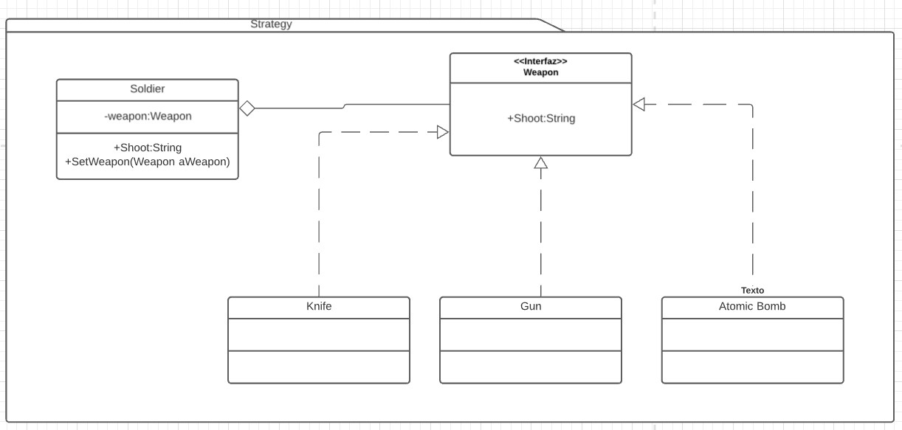

# Strategy
Es un patrón de comportamiento. [Link descripción](https://sourcemaking.com/design_patterns/strategy)

Este patrón se utiliza para reducir el acoplamiento entre el cliente y una serie de algoritmos de una misma familia que pueden ser intercambiados entre ellos para responder a la llamada del cliente.

## Diagrama de clases

## SOLID

* Single responsability

Usar objetos strategy en lugar de varios if anidados ayudan a mantener las clases con una responsabilidad única.

* Open/Closed principle

Otro punto que es apoyado por el patrón ya que es muy facil extender la funcionalidad creando nuevas clases para ser usadas en el strategy.

* Liskov substitution

Los implementadores de la interfaz pueden ser intercambiados entre sí y el cliente no notara diferencia. 

* Interface segregation

Tener varias estrategias para implementar el algoritmo a ser "cambiado" en el cliente nos ayuda a tener clases pequeñas y mantener segregadas las responsabilidades

* Dependency inversion

Programando contra la interfaz de herencia superior nos permite cumplir con este principio.